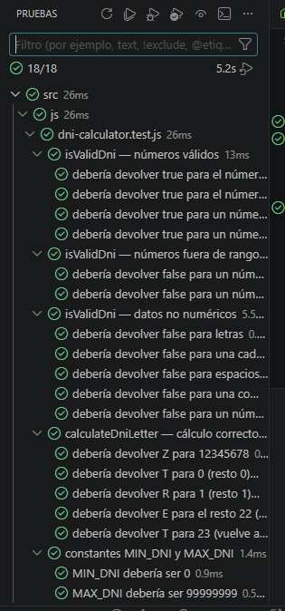
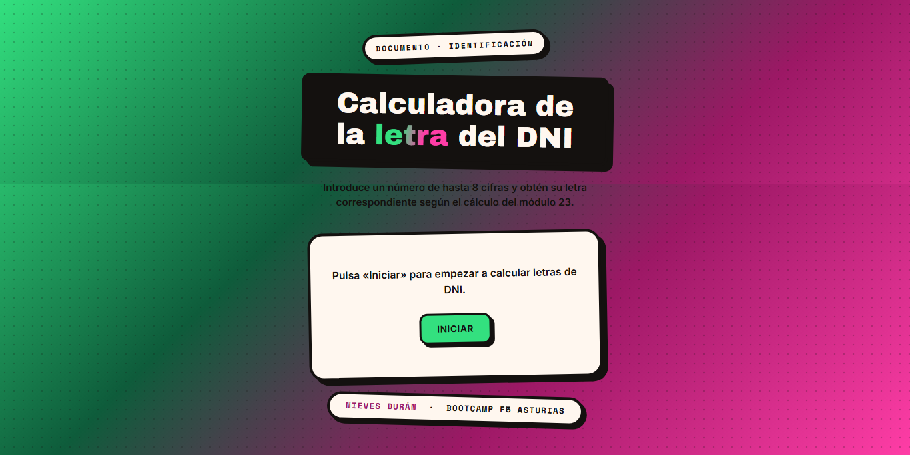

# Calculadora de la letra del DNI

## 📝 Descripción

Este proyecto consiste en la creación de una aplicación web que calcula la letra correspondiente a un número de DNI español, validando que el dato introducido sea correcto y permitiendo repetir el cálculo tantas veces como se quiera hasta que el usuario decida cancelar.

## 🔍 Análisis

Se han extraído las siguientes reglas de negocio:

**Rango válido:** el número debe estar entre 0 y 99999999.

**Algoritmo de cálculo: letra =** tabla[numero % 23], donde la tabla de letras es:
T, R, W, A, G, M, Y, F, P, D, X, B, N, J, Z, S, Q, V, H, L, C, K, E (índices del 0 al 22).

**Validación de tipo:** si el valor introducido no es numérico, debe mostrarse el mensaje "El dato introducido es incorrecto".

**Validación de rango:** si el número está fuera de [0, 99999999], debe mostrarse el mismo mensaje de error.

**Repetición:** tanto si el cálculo es correcto como si hay un error, el sistema debe volver a solicitar un nuevo número.

**Cancelación:** el usuario puede finalizar el proceso en cualquier momento pulsando «Cancelar».

## 🛠️ Planificación

El desarrollo se organiza en fases incrementales, cada una con sus propios commits atómicos y su propia rama (rama de la tarea → commit en la rama → merge a dev → borrado de la rama)

* **1.** Prototipo | Estructura HTML semántica, BEM, accesibilidad básica, Sass modular 

* **2.** Identidad visual | Paleta verde + rosa, estilo gráfico atrevido, sello de resultado 

* **3.** Documentación | README con descripción, análisis, planificación y tecnologías 

* **4.** Footer | Pie de página con nombre, bootcamp y academia 

* **5.** Lógica de negocio | Módulo JS independiente desacoplado del DOM 

* **6.** Tests unitarios | 18 tests con Vitest cubriendo todos los escenarios

## 💻 Tecnologías Utilizadas

* **HTML5 semántico**, con atributos ARIA para accesibilidad.

* **Sass** (modular, mediante @use y partials) compilado a CSS con la CLI de sass.

* **JavaScript** (vanilla, ES2015+), sin frameworks, organizado por responsabilidades.

* **Vitest** — tests unitarios con TDD (ciclo Red-Green-Refactor), 18 tests pasados.

* **Node.js / npm** — gestión de dependencias y scripts (npm run sass, npm run sass-w).

* **Git / GitHub** — control de versiones con commits atómicos y flujo de ramas (feature → dev).

* **Google Fonts** — Archivo Black (titulares), Space Mono (números y letra), Inter (texto de interfaz).

* **Metodología de nomenclatura BEM** (bloque__elemento--modificador) y **kebab-case** para los nombres de archivo.

## 🎨 Diseño

* **Paleta:** combinación de verde (#33e07f) y rosa (#ff3da6) a partes iguales, con negro cálido para contornos/sombras y crema para las superficies con texto, de modo que el contenido siga siendo legible sobre un fondo muy saturado.

* **Estilo visual:** lenguaje "cómic / pegatina" (bordes gruesos, sombras duras sin desenfoque, elementos ligeramente rotados), elegido para que la página se sienta atrevida y original en lugar de plantillada.

* **Elemento distintivo:** el resultado se muestra como una pila de dos pegatinas circulares (rosa detrás, verde delante) con la letra calculada.

* **Accesibilidad:** foco visible reforzado, role="alert" en el mensaje de error, aria-describedby en el campo del DNI y prefers-reduced-motion respetado en todas las animaciones/transiciones.

## 🎬 Escenarios cubiertos

* Iniciar el sistema.

* DNI válido → letra correcta según el módulo 23.

* Número fuera de rango (< 0 o > 99999999) → mensaje de error.

* Dato no numérico → mensaje de error.

* Repetición del proceso tras un cálculo.

* Cancelación del proceso → fin del programa.

## 📷 Captura Tests

## 📷 Prototipo

